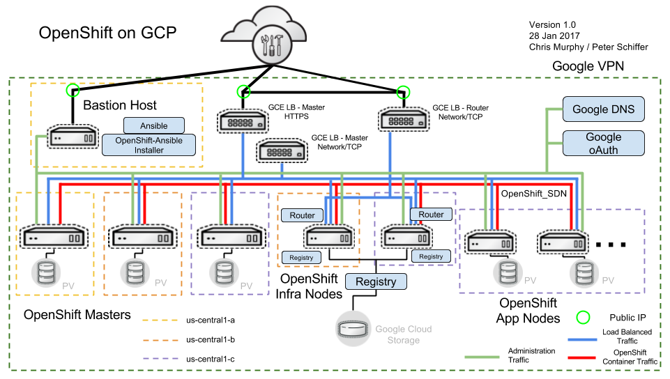
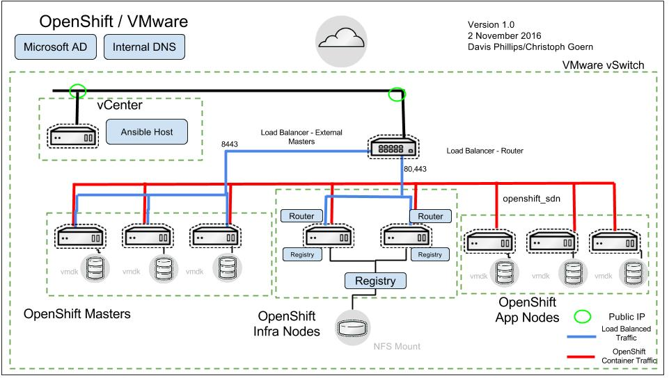

Reference Architectures
----------

**************
## OCP-on-AWS

**************
## OCP-on-VMWare

**************
## OCP-on-OpenStack
	* [Install](https://github.com/openshift/openshift-ansible-contrib/tree/master/reference-architecture/osp-cli)
	* [Documentation](https://access.redhat.com/documentation/en-us/reference_architectures/2017/html-single/deploying_and_managing_red_hat_openshift_container_platform_3.6_on_red_hat_openstack_platform_10/)

## OCP-on-RHV
        * [Install](https://github.com/openshift/openshift-ansible-contrib/tree/master/reference-architecture/rhv-ansible)
        * [Documentation](https://access.redhat.com/documentation/en-us/reference_architectures/2017/html-single/deploying_red_hat_openshift_container_platform_3.6_on_red_hat_virtualization_4/)
